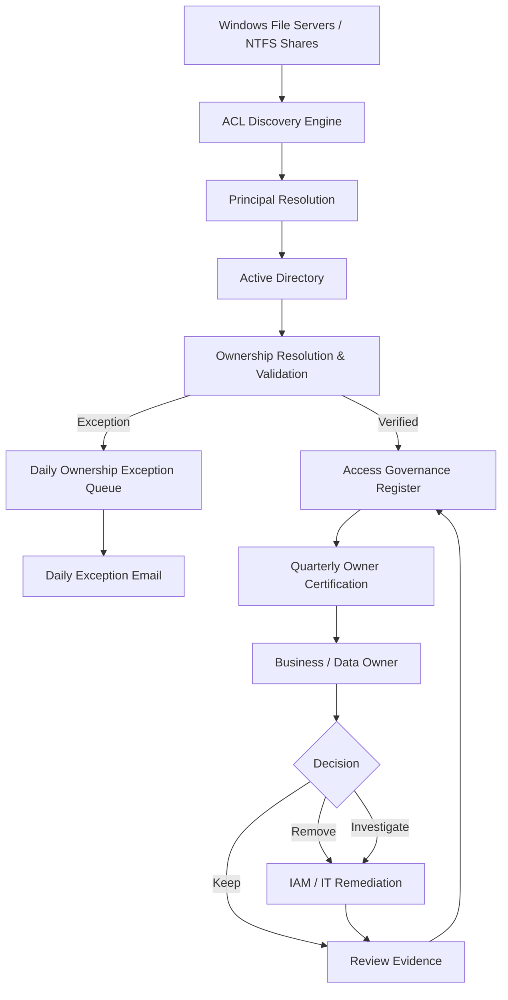

# FileShare Access & Ownership Governance

A practical IAM governance toolkit for traditional Windows file shares using NTFS ACLs and Active Directory identities.

> **Scope:** This solution provides automated access discovery, ownership validation and periodic access certification for traditional Windows file shares governed by NTFS permissions and Active Directory identities. SharePoint may be used to store review data and evidence but is not itself an access target managed by this solution.

## Why this exists
Traditional file shares often accumulate permissions over many years. ACLs may be technically visible but difficult to govern: access groups may have no accountable owner, owners may have left the organisation, users may be granted permissions directly, and periodic reviews can become an IT-only spreadsheet exercise.

This project treats **ownership as a first-class control**. IT/IAM operates the technical control; verified business/data owners decide whether access to the resources for which they are accountable remains appropriate.

## Operating model

**Discover → Resolve → Validate Ownership → Monitor → Certify → Remediate → Evidence**

The solution has three operating cycles:

1. **Daily ownership assurance** — lightweight validation of known ACL groups and their registered owners. Exceptions such as missing or disabled owners are reported for early remediation.
2. **Quarterly owner certification** — verified owners receive a review of the file-share access within their ownership scope and certify, remove or investigate access.
3. **IAM/IT remediation and evidence** — requested changes are implemented and review history is retained as governance evidence.

## Ownership standard
Preferred owner source order:

1. Active Directory `managedBy` — authoritative and machine-resolvable.
2. Configurable AD extension attribute — optional organisational fallback.
3. Structured `Owner:` value in group Description — legacy fallback only.
4. No resolvable active owner — governance exception.

Ownership is never silently trusted. The validation engine checks whether the referenced object exists, is an appropriate object type, is enabled and has a usable identity for workflow/email purposes.

### Core ownership states

- `OWNER_VERIFIED`
- `OWNER_MISSING`
- `OWNER_NOT_FOUND`
- `OWNER_DISABLED`
- `OWNER_INVALID_OBJECT_TYPE`
- `OWNER_NO_EMAIL`
- `OWNER_CONFLICT`
- `GROUP_NOT_FOUND`
- `UNRESOLVED_SID`

## High-level architecture

## Important boundary
This project does **not** enumerate or govern permissions inside SharePoint Online document libraries, Teams, OneDrive or other Microsoft 365 repositories. SharePoint can be a destination for the access register, workflow status and audit evidence only.

## Repository

- `scripts/` — PowerShell discovery, ownership validation, reporting and publishing components.
- `config/` — server inventory and configuration examples.
- `docs/` — architecture, governance model, operations, ISO 27001 alignment and implementation guidance.
- `diagrams/` — Mermaid source diagrams suitable for GitHub publication.
- `examples/` — example scan, exception and review datasets.
- `templates/` — sample daily and quarterly HTML emails.

## Quick start

1. Copy `config/FileServers.example.csv` to `config/FileServers.csv` and define the file servers/shares in scope.
2. Copy `config/Settings.example.json` to a protected operational location and configure ownership fallbacks and output paths.
3. Run `scripts/Invoke-AccessGovernance.ps1 -Mode Discovery` from an account with read access to the relevant ACLs and AD read permissions.
4. Review `OwnershipExceptions.csv` before starting owner certification.
5. Schedule `-Mode OwnershipCheck` overnight for daily ownership hygiene.
6. Use `-Mode QuarterlyReview` at the beginning of the certification cycle.

> The included scripts are designed as a safe publication baseline. Test in a representative non-production or limited-scope environment before enterprise deployment.

## ISO / IAM positioning
This toolkit can support access-rights management, ownership accountability, periodic access review, remediation tracking and retained evidence within the defined Windows file-share scope. It does not by itself make an organisation ISO 27001 compliant and should operate within the organisation's broader IAM, information security and data-governance framework.

## Roadmap
Future modules may use the same governance pattern for SharePoint Online, Teams/M365 Groups, OneDrive and other repositories, but those platforms are deliberately outside v1.0.

## v1.0 implementation baseline

The implementation is deliberately **read-only with respect to permissions and Active Directory**. Discovery and assurance collect evidence and identify remediation; they do not automatically remove ACLs, alter group membership or reassign ownership. This separation keeps business approval, technical change and evidence distinct.

Operational modes:
- `Discovery` — recursively/non-recursively enumerates configured NTFS paths, resolves AD principals, validates group ownership and creates an access register plus exception dataset.
- `OwnershipCheck` — revalidates known ACL groups from the latest register without rescanning every directory, ages exceptions and can generate the daily HTML report.
- `QuarterlyReview` — groups verified records by owner and creates owner-specific certification CSV/email packages; unresolved ownership is diverted to a governance exception file.

See [`docs/09-Implementation-Runbook.md`](docs/09-Implementation-Runbook.md) and [`docs/10-Testing-and-Acceptance.md`](docs/10-Testing-and-Acceptance.md) before deployment.
