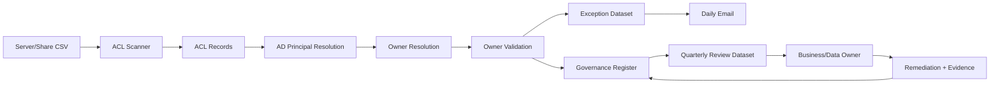

# Architecture

## Components
1. File-server inventory
2. ACL discovery engine
3. AD principal resolver
4. Ownership resolver and validator
5. Access governance register
6. Daily exception workflow
7. Quarterly certification workflow
8. Remediation/evidence register

## Data flow

## Security design
The scanner should operate read-only against file-system ACLs and AD. Publishing or remediation functions should use separately controlled identities/permissions where practical. Credentials and secrets must not be embedded in repository files.
