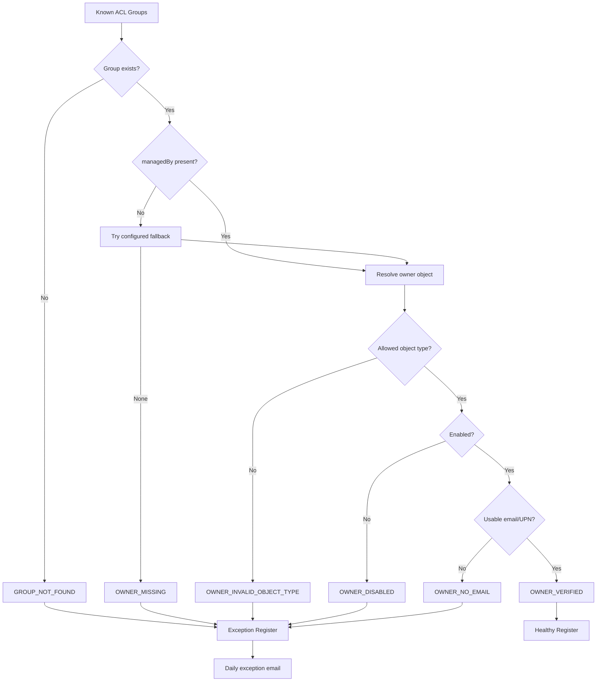

# Daily Ownership Assurance

The overnight process is intentionally lightweight. It revalidates known access groups and owners rather than recursively scanning every directory each night.

Track first detected, last detected, age and resolution so the daily report can distinguish new, outstanding and resolved exceptions.
