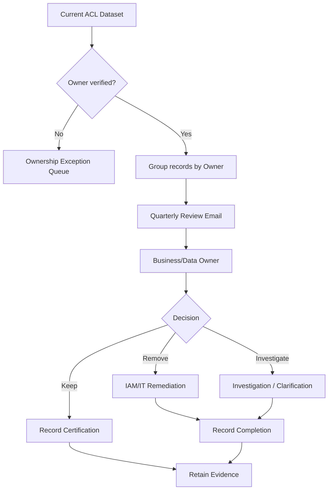

# Quarterly Owner Certification

Only verified owners should receive access-certification requests. Ownership exceptions are routed to governance/IAM for correction first.

The review register should capture period, reviewer, date, decision, comments, remediation requirement/status and evidence ID.
